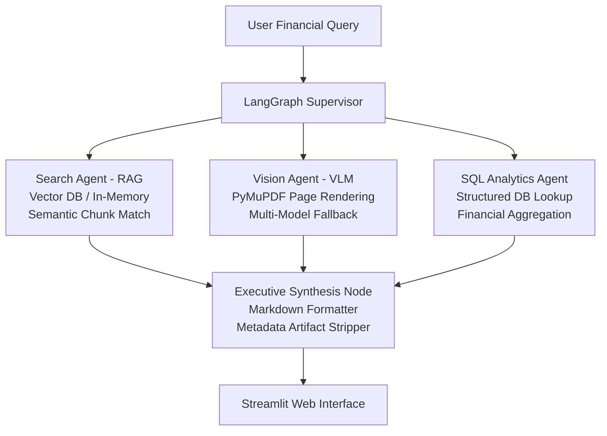

# OmniBrain: Agentic Multimodal Financial RAG 🧠📊

OmniBrain is an agentic Multimodal Retrieval-Augmented Generation (RAG) system built to parse, analyze, and synthesize insights from SEC 10-K and other financial filings. Orchestrated with **LangGraph**, it dynamically routes queries between a **Semantic Vector RAG Agent**, a **Gemini Multimodal Vision Agent**, and a structured **SQL Analytics Engine**.

---

## 🏛️ System Architecture



---

## ⚡ Key Capabilities

- **Deterministic Supervisor Routing:** Detects visual cues (`table`, `chart`, `page`), database intents (`sql`, `grouped by`, `revenue`), or standard research questions and routes each to the best sub-agent.
- **Multimodal Document Vision:** Converts target PDF pages to images with PyMuPDF and uses Gemini Vision (`gemini-2.5-flash`, `gemini-1.5-flash`) to reconstruct complex financial tables and comparison charts.
- **Resilient Cascade Fallbacks:** Handles API 503 load spikes with automatic multi-model retries and a direct in-memory PyMuPDF extraction fallback.
- **Zero-Artifact Output Engine:** A post-processing pipeline strips raw ingestion artifacts, scrap tags (`[Excerpt X]`), and repeated header rows to produce clean executive tables.

---

## 📁 Repository Structure

```text
├── agents/
│   ├── supervisor.py         # Deterministic routing logic (SQL vs Vision vs Search)
│   ├── search_agent.py       # Semantic vector retrieval and context ranking
│   └── sql_agent.py          # Structured analytical query processing
├── graph/
│   ├── state.py              # LangGraph AgentState TypedDict schema
│   └── workflow.py           # State machine execution graph and synthesis nodes
├── vision/
│   └── image_processor.py    # PyMuPDF page rendering and Gemini Vision extraction
├── rag/
│   └── pdf_loader.py         # Financial document ingestion and chunk indexing
├── frontend/
│   └── app.py                # Streamlit UI dashboard and real-time trace display
├── data/                     # Ingested PDF filings (e.g., Apple FY24 10-K)
├── requirements.txt          # Production dependencies
└── README.md                 # Project documentation
```

---

## 🚀 Quick Start Guide

### 1. Set Up the Local Environment

```bash
git clone https://github.com/KAVINGUPTA09/OmniBrain-Agentic-Multimodal-RAG1.git
cd OmniBrain-Agentic-Multimodal-RAG1
python -m venv venv

# Windows
.\venv\Scripts\activate
# macOS / Linux
# source venv/bin/activate

pip install --upgrade pip
pip install -r requirements.txt
```

### 2. Configure Environment Keys

Create a `.env` file in the root folder:

```env
GEMINI_API_KEY=your_gemini_api_key_here
```

### 3. Launch the Application

```bash
streamlit run frontend/app.py
```

---

## 🧪 Benchmark Prompts

| Target Node | Query Formulation |
|---|---|
| **Vision Agent** | `vision: Extract the gross margin table and percentages for Products vs Services on page 23 of the Apple 10-K document.` |
| **SQL Engine** | `Run a SQL query to calculate the average quarterly revenue for 2024.` |
| **Search / RAG** | `From the Apple 10-K 2024 filing, what was the total net sales for fiscal year 2024, and what was the percentage breakdown between Products and Services?` |

---

## 📜 License

Distributed under the MIT License. See `LICENSE` for details.
